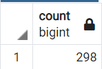

# Pewlett_Hackard_Analysis

## Purpose

The purpose of this analysis was to determine the number of employees that are soon to retire, the position they held, and to determine if Pewlett Hackard has enough employees with experience to mentor incoming employees.
The goal was to collect all of this information into tables using PostgreSQL.

## Results

- There are a total of 72,458 employees that are going to retire.
- The Senior Engineer and Senior Staff positions will have the greatest reduction in size

- There are a total of 1,549 employees that are eligible to mentor incoming employees.
- All eligible employees were born in the year 1965

## Summary

- 72, 458 employees will need to be hired to fill all the positions

- Of the 29,516 retiring Senior Engineers, there are 399 eligible to mentor
- Each mentor would have to mentor about 65 incoming employees

- Of the 24,926 retiring Senior Staff, there are 298 eligible to mentor
- Each mentor would have to mentor about 84 incoming employees

- Of the 9,285 retiring Engineers, there are 302 eligible to mentor
- Each mentor would have to mentor about 31 incoming employees

- Of the 7,636 retiring Staff, there are 426 eligible to mentor
- Each mentor would have to mentor about 18 incoming employees

- Of the 3,603 retiring Technique Leaders, there are 77 eligible to mentor
- Each mentor would have to mentor about 47 incoming employees

- Of the 1,090 retiring Assistant Engineers, there are 47 eligible to mentor
- Each mentor would have to mentor about 23 incoming employees

- Of the 2 retiring Managers, there are 0 eligible to mentor

I believe there are enough qualified, retirement-ready employees in the department to mentor the next wave of employees.

It will be difficult for the Senior Engineers and Senior Staff, but I believe it is do-able. The employees taking the position will likely be experienced enough to quickly adapt.

For the managers, only 2 are retiring so I don't think that will be a problem.

